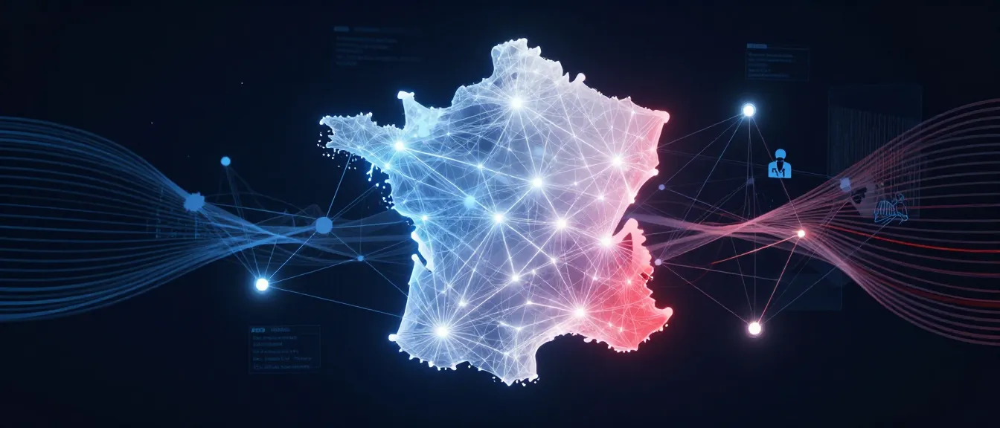

<p align="center">
  
</p>

<h1 align="center">Grand Débat National GraphRAG</h1>

<p align="center">
  <strong>Explorez les voix citoyennes à travers un graphe de connaissances 3D interactif</strong>
</p>

<p align="center">
  <em>« La voix des citoyens, visualisée »</em>
</p>

<p align="center">
  <a href="https://nextjs.org">
    
  </a>
  <a href="https://react.dev">
    
  </a>
  <a href="https://www.typescriptlang.org">
    
  </a>
</p>

<p align="center">
  Explorez les <em>Cahiers de Doléances</em> du Grand Débat National 2019 — contributions citoyennes de 50 communes de Charente-Maritime.
</p>

---

## Table des Matières

- [Qu'est-ce que c'est ?](#quest-ce-que-cest-)
- [Fonctionnalités](#fonctionnalités)
- [Exemples de requêtes](#exemples-de-requêtes)
- [Constitution v3.2.0](#constitution-v320---principes-de-conception)
- [Performance & Architecture](#performance--architecture)
  - [Objectifs de Performance](#objectifs-de-performance)
  - [Architecture de Cache](#architecture-de-cache-5-couches)
  - [Niveau de Détail (LOD)](#niveau-de-détail-lod)
- [Stack Technique](#stack-technique)
- [Développement](#développement)
- [Déploiement](#déploiement)

---

## Qu'est-ce que c'est ?

Début 2019, la France a lancé le **Grand Débat National** — une consultation nationale sans précédent où les citoyens pouvaient exprimer leurs préoccupations, leurs espoirs et leurs propositions pour l'avenir de la République. Cette interface redonne vie à ces voix.

Explorez les *Cahiers de Doléances* à travers un graphe de connaissances 3D interactif. Posez des questions en langage naturel et observez comment les thèmes civiques, les préoccupations et les propositions émergent — connectés entre les communes, révélant les motifs de ce qui compte vraiment pour les citoyens.

**Interface mono-source** : Se connecte exclusivement au serveur MCP du Grand Débat National. Aucune autre source de données.

**Source des données** :
- **Serveur MCP** : `https://graphragmcp-production.up.railway.app/mcp`
- **Jeu de données** : Cahiers de Doléances 2019
- **Couverture** : 50 communes de Charente-Maritime
- **Entités** : ~8 000+ extraites des contributions citoyennes

## Fonctionnalités

| Fonctionnalité | Description |
|----------------|-------------|
| Requête civique | Posez des questions sur les préoccupations, propositions et thèmes citoyens |
| Graphe 3D force-directed | Visualisation interactive des entités civiques et leurs relations |
| Attribution par commune | Chaque réponse traçable jusqu'à la commune source et au texte citoyen |
| Analyse inter-communes | Comparez les thèmes et préoccupations à travers les 50 communes |
| Responsive mobile | Fonctionne sur ordinateur, tablette et mobile |

## Exemples de requêtes

- « Quelles sont les préoccupations des citoyens sur les impôts ? »
- « Que disent les citoyens sur les services publics ? »
- « Quels thèmes reviennent le plus souvent ? »

## Constitution v3.2.0 - Principes de Conception

Ce projet suit la **Constitution v3.2.0** - une interface de graphe de connaissances civique mono-source avec 11 principes architecturaux :

| Principe | Description |
|----------|-------------|
| **I. Interprétabilité de bout en bout** | Permettre la navigation complète du chunk de texte citoyen jusqu'à la réponse RAG via les entités et relations du graphe |
| **II. Chaîne de provenance civique** | Toutes les données traçables jusqu'à la commune source et au texte citoyen original avec attribution explicite |
| **III. Pas de noeuds orphelins** | Tous les noeuds affichés doivent avoir au moins une relation (filtrage automatique des entités isolées) |
| **IV. Architecture centrée sur les communes** | Les communes sont les unités organisationnelles principales pour toutes les requêtes et visualisations |
| **V. Analyse inter-communes** | Permettre la découverte de patterns à travers plusieurs communes (comparaison régionale et agrégation) |
| **VI. Source unique civique** | Connexion EXCLUSIVE au serveur MCP Grand Débat National (pas de sélection de source, session pool, retry strategy) |
| **VII. Interface fonctionnelle** | Design minimaliste centré sur le contenu civique (clarté, efficacité, workflows d'exploration) |
| **VIII. Responsive mobile-first** | Entièrement fonctionnel sur appareils mobiles (interactions tactiles, layout adaptatif, performance) |
| **IX. Observabilité RAG** | Visibilité complète des opérations GraphRAG (traçage, provenance, phases de traitement, métriques) |
| **X. Qualité & Maintenabilité du code** | Codebase propre, type-safe (TypeScript strict), zéro code mort, responsabilité unique |
| **XI. Architecture d'optimisation des performances** | Patterns architecturaux pour atteindre les cibles de performance (caching 5 couches, LOD, chargement progressif) |

**Version:** 3.2.0
**Ratification:** 2025-11-18
**Dernière modification:** 2026-01-06

Pour détails complets : [`.specify/memory/constitution.md`](.specify/memory/constitution.md)

## Performance & Architecture

### Objectifs de Performance

L'interface respecte des cibles de performance strictes définies dans le Principe XI :

| Opération | Cible | Contexte |
|-----------|-------|----------|
| Démarrage | <3s (fresh) / <1s (cached) | Chargement initial de l'interface avec GraphML |
| Requête simple | <10s | Interrogation d'une seule commune (mode local) |
| Requête 15 communes | <30s | Multi-commune avec agrégation |
| Requête 50 communes | <90s | Interrogation complète du dataset |
| Interaction graphe | ≥30 fps | Rendu stable jusqu'à 500 noeuds |

**SLA** : Les requêtes dépassant ces cibles déclenchent un chargement progressif avec feedback visuel.

### Architecture de Cache (5 Couches)

Le système implémente une architecture de cache sophistiquée sur 5 couches :

| Couche | Localisation | TTL | Stratégie d'éviction | Objectif |
|--------|--------------|-----|---------------------|----------|
| **1. Cache de requêtes** | Client (browser) | 5 min | FIFO (100 entrées max) | Éviter les appels MCP redondants |
| **2. Session pool** | Frontend API route | 5 min | FIFO (3 sessions max) | Réutiliser les connexions MCP |
| **3. Cache GraphRAG** | Backend server.py | Variable | LRU (10 communes) | Éviter la réinit par commune |
| **4. Cache LLM** | Backend graphrag.py | 1 heure | LRU | Éviter les appels LLM dupliqués |
| **5. Cache embeddings** | Backend vector DB | 24 heures | LRU | Éviter les embeddings dupliqués |

**Clés de cache** : SHA-256 de la requête + communes sélectionnées (déterministe, collision-resistant)

**Implémentation** :
- Client : Cache inline dans `law-graphrag.ts`
- Session pool : Pool de connexions MCP avec cleanup automatique (60s)
- Retry strategy : Backoff exponentiel (1s, 2s) avec détection d'erreurs permanentes

### Niveau de Détail (LOD)

La visualisation 3D ajuste automatiquement le niveau de détail selon la distance de caméra :

| Distance | Résolution | Particules | Objectif |
|----------|-----------|------------|----------|
| <200 unités | Complète | Activées | Détail maximal pour exploration proche |
| 200-500 unités | Réduite | Désactivées | Performance équilibrée |
| >500 unités | Minimale | Désactivées | Maintien de la visibilité globale |

**Note importante** : Le culling (masquage de noeuds distants) est **intentionnellement désactivé** pour préserver l'interprétabilité de bout en bout (Principe I). Tous les noeuds et relations restent visibles quel que soit le niveau de zoom.

## Stack Technique

| Catégorie | Technologies |
|-----------|-------------|
| **Framework** | Next.js 16, React 19.2, TypeScript 5.2 |
| **Visualisation** | 3d-force-graph 1.79, Three.js 0.181, D3.js 7.8.5 |
| **Style** | Tailwind CSS 3.3.5, Cormorant Garamond (typography) |
| **Backend** | MCP (Model Context Protocol) over HTTP/SSE |
| **Protocole** | JSON-RPC 2.0 avec Server-Sent Events |

### Composants Principaux

| Composant | Fichier | Responsabilité |
|-----------|---------|----------------|
| Shell applicatif | `BorgesLibrary.tsx` | État global, orchestration |
| Graphe 3D | `GraphVisualization3DForce.tsx` | Rendu force-directed, détection communes |
| Interface de requête | `QueryInterface.tsx` | Recherche en langage naturel |
| Détails d'entité | `EntityDetailModal.tsx` | Affichage provenance et connexions |
| Proxy MCP | `app/api/law-graphrag/route.ts` | Session pool, retry, SSE parsing |
| Client MCP | `lib/services/law-graphrag.ts` | Cache inline, appels outils MCP |

**Architecture du code** :
```
3_borges-interface/
├── src/
│   ├── app/api/law-graphrag/   # Route proxy MCP
│   ├── components/             # Composants React (graphe, modales, requête)
│   ├── lib/services/           # Service client MCP
│   └── types/                  # Définitions TypeScript
```

### Outils MCP Disponibles

Le serveur MCP expose 6 outils pour l'exploration civique :

| Outil | Description |
|-------|-------------|
| `grand_debat_list_communes` | Lister les 50 communes avec statistiques |
| `grand_debat_query` | Interroger une commune (mode local/global) |
| `grand_debat_query_all` | Interroger toutes les communes avec agrégation |
| `grand_debat_search_entities` | Rechercher des entités par pattern |
| `grand_debat_get_communities` | Obtenir les rapports de communautés thématiques |
| `grand_debat_get_contributions` | Obtenir les textes citoyens originaux |

**Serveur MCP** : `https://graphragmcp-production.up.railway.app/mcp`

## Développement

### Prérequis

- Node.js 18+
- npm ou yarn
- Accès réseau au serveur MCP (vérifier `LAW_GRAPHRAG_API_URL`)

### Installation

```bash
cd 3_borges-interface
npm install
npm run dev
```

Ouvrir [http://localhost:3000](http://localhost:3000)

### Variables d'Environnement

Créer `3_borges-interface/.env.local` :

```env
# Serveur MCP Grand Débat National (requis)
LAW_GRAPHRAG_API_URL=https://graphragmcp-production.up.railway.app
```

### Tests

1. **Test serveur MCP** : Vérifier l'accessibilité avant de lancer l'interface
2. **Test requêtes civiques** : Essayer "Quelles sont les préoccupations sur les impôts ?"
3. **Vérifier attribution** : Confirmer que les résultats affichent les communes sources
4. **Test performance** : Requête simple (<10s), 15 communes (<30s)
5. **Test mobile** : Interactions tactiles (tap, pinch, drag) sur tablette/mobile

### Commandes Utiles

```bash
npm run dev         # Développement (port 3000)
npm run build       # Build production
npm run start       # Serveur production local
npm run lint        # ESLint
npm run type-check  # Vérification TypeScript
```

## Déploiement

Déployé sur **Vercel** avec :
- Répertoire racine : `3_borges-interface/`
- Preset framework : Next.js

L'interface se connecte au serveur MCP déployé sur Railway.

## Licence

MIT

---

<p align="center">
  <sub>Construit avec GraphRAG | Grand Débat National 2019 | 50 communes de Charente-Maritime</sub>
  <br>
  <sub>Image d'en-tête générée avec <a href="https://huggingface.co/spaces/mcp-tools/Z-Image-Turbo">Z-Image Turbo</a> sur Hugging Face</sub>
</p>
