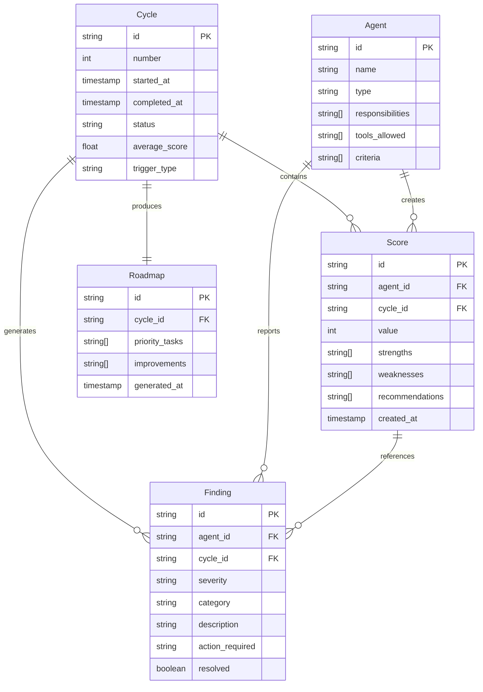

# Data Model: Agent Orchestration Grand Débat National

**Feature**: 005-agent-orchestration
**Date**: 2024-12-24
**Status**: Complete

## Entity Overview



## Entity Definitions

### Agent

Représente un agent Claude Code spécialisé dans l'orchestration.

| Field | Type | Required | Description |
|-------|------|----------|-------------|
| `id` | string | Yes | Identifiant unique (ex: `ontology-agent`) |
| `name` | string | Yes | Nom affichable (ex: `Agent Ontologie`) |
| `type` | enum | Yes | `orchestrator`, `validator`, `chief` |
| `responsibilities` | string[] | Yes | Liste des responsabilités |
| `tools_allowed` | string[] | Yes | Outils Claude Code autorisés |
| `criteria` | string[] | Yes | Critères de scoring spécifiques |

**Instances prédéfinies**:
- `design-chief`: Orchestrateur principal
- `ontology-agent`: Validation schéma ontologique
- `data-agent`: Intégrité VectorStore/GraphStore
- `mcp-agent`: Interprétabilité bout-en-bout
- `interface-agent`: Binding UI/données
- `uxui-chief`: Tests UX, mobile, branding
- `product-chief`: Business model, commercialisation

### Cycle

Représente un cycle d'orchestration complet.

| Field | Type | Required | Description |
|-------|------|----------|-------------|
| `id` | string | Yes | Format: `cycle-{number}` |
| `number` | int | Yes | Numéro séquentiel du cycle |
| `started_at` | timestamp | Yes | Début du cycle (ISO 8601) |
| `completed_at` | timestamp | No | Fin du cycle |
| `status` | enum | Yes | `running`, `completed`, `failed`, `partial` |
| `average_score` | float | No | Moyenne des scores agents (1-10) |
| `trigger_type` | enum | Yes | `auto` (post-implement), `manual` |

**Règles métier**:
- Un cycle est `completed` quand tous les agents ont rapporté
- Un cycle est `partial` si timeout après 5 minutes
- Un cycle est `failed` si erreur critique bloquante

### Score

Évaluation produite par un agent.

| Field | Type | Required | Description |
|-------|------|----------|-------------|
| `id` | string | Yes | Format: `{agent_id}-{cycle_id}` |
| `agent_id` | string | Yes | Référence vers Agent |
| `cycle_id` | string | Yes | Référence vers Cycle |
| `value` | int | Yes | Score 1-10 |
| `strengths` | string[] | Yes | Points positifs identifiés |
| `weaknesses` | string[] | Yes | Points à améliorer |
| `recommendations` | string[] | Yes | Actions recommandées |
| `created_at` | timestamp | Yes | Horodatage création |

**Interprétation des scores**:
| Plage | Interprétation | Action |
|-------|----------------|--------|
| 9-10 | Excellent | Aucune action requise |
| 7-8 | Satisfaisant | Améliorations optionnelles |
| 5-6 | Acceptable | Améliorations recommandées |
| 3-4 | Insuffisant | Améliorations requises |
| 1-2 | Critique | Action immédiate requise |

### Finding

Observation spécifique d'un agent.

| Field | Type | Required | Description |
|-------|------|----------|-------------|
| `id` | string | Yes | Format UUID |
| `agent_id` | string | Yes | Agent source |
| `cycle_id` | string | Yes | Cycle de détection |
| `severity` | enum | Yes | `critical`, `major`, `minor`, `info` |
| `category` | enum | Yes | Voir catégories ci-dessous |
| `description` | string | Yes | Description du problème |
| `action_required` | string | No | Action corrective suggérée |
| `resolved` | boolean | Yes | Statut de résolution |

**Catégories de Findings**:
- `ontology`: Conformité schéma
- `data`: Intégrité données
- `mcp`: Interprétabilité
- `interface`: Binding UI
- `ux`: Accessibilité, responsive
- `branding`: Cohérence visuelle
- `product`: Business model

### Roadmap

Plan d'amélioration généré par le Chef Designer.

| Field | Type | Required | Description |
|-------|------|----------|-------------|
| `id` | string | Yes | Format: `roadmap-{cycle_id}` |
| `cycle_id` | string | Yes | Cycle source |
| `priority_tasks` | string[] | Yes | Tâches prioritaires (score < 7) |
| `improvements` | string[] | Yes | Améliorations suggérées |
| `generated_at` | timestamp | Yes | Horodatage génération |

## Relations

| Relation | Description |
|----------|-------------|
| Cycle → Score | 1:N - Un cycle contient 7 scores (1 par agent) |
| Cycle → Finding | 1:N - Un cycle génère 0-N findings |
| Cycle → Roadmap | 1:1 - Un cycle produit une roadmap |
| Agent → Score | 1:N - Un agent produit 1 score par cycle |
| Agent → Finding | 1:N - Un agent peut rapporter plusieurs findings |
| Score → Finding | 1:N - Un score peut référencer des findings |

## Storage Format

Tous les artefacts sont stockés en **fichiers Markdown** avec frontmatter YAML:

```
specs/005-agent-orchestration/
├── scores/
│   ├── cycle-001/
│   │   ├── ontology.md      # Score Agent Ontologie
│   │   ├── data.md          # Score Agent Data
│   │   ├── mcp.md           # Score Agent MCP
│   │   ├── interface.md     # Score Agent Interface
│   │   ├── uxui.md          # Score Chef UX/UI
│   │   ├── product.md       # Score Chef Produit
│   │   └── summary.md       # Agrégation Chef Designer
│   └── latest -> cycle-001/
├── findings/
│   └── cycle-001/
│       └── all-findings.md  # Findings consolidés
└── roadmap.md               # Roadmap active
```

## Validation Rules

### Score Validation
- `value` DOIT être entre 1 et 10 inclus
- `strengths` DOIT contenir au moins 1 élément
- `weaknesses` PEUT être vide si score ≥ 9
- `recommendations` DOIT contenir au moins 1 élément si score < 7

### Finding Validation
- `severity: critical` DOIT avoir `action_required`
- `category` DOIT correspondre à l'agent source
- `resolved: true` DOIT avoir une note de résolution

### Cycle Validation
- `completed_at` DOIT être postérieur à `started_at`
- `average_score` calculé après tous scores reçus
- Timeout à 5 minutes → `status: partial`

---

**Model Status**: COMPLETE
**Ready for**: contracts/ generation
